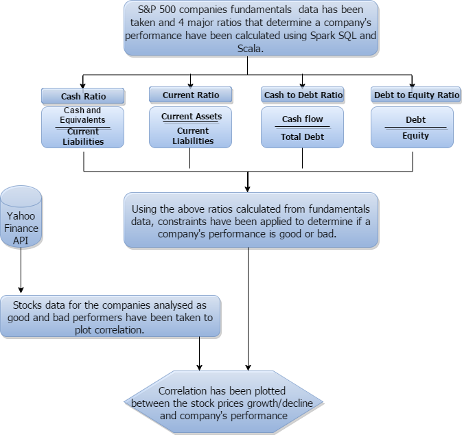

# Stock Analysis, Correlational Relationships and Financial Forecasting

In this blog post we will look at how Apache Spark can be used for analysing Stock market for companies using their fundamental metrics such as Cash Ratio, Debt Ratio, Liablities, Equaties etc. Futhermore, we will also figure out the correlation between stock movements captured from Yahoo Finance data and Twitter sentiment through real-time streaming analysis. With these factors along with Financial Data from Google, we can deduce a naive machine learning algorithm to predict the movements for coming week, We will be using Spark's libraries for MLlib, Streaming and SQL. We will also visualize the sentiments as a time series plot and location. I have made an Scala-Maven-IntelliJ Project to perform the analysis.

## Data Sources
- [Stock Performance Analysis Dataset](https://www.kaggle.com/dgawlik/nyse)
- Twitter Sentiment Analysis through Real-time Streaming using [Twitter4j Steam](https://mvnrepository.com/artifact/org.twitter4j/twitter4j-stream) and [Twitter4j Core](https://mvnrepository.com/artifact/org.twitter4j/twitter4j-core)
- Spark library to extract [Google Financial Forecasting Dataset](https://github.com/crealytics/spark-google-analytics)

## Stock Performance Analysis

We worked on answering such questions "Which company has biggest chance of being bankrupt? Which one is undervalued (how prices behaved afterwards) or vice versa". ```Cash Ratio, Debt Ratio, Cash to Debt Ration, Debt to Equity Ratio ``` performs major role in determining company's performance. We rated the performance of a company as good or bad based on 

| Left-aligned | Good Performer | Bad Performer |
|     :---:    |     :---:      |     :---:     |
| Cash Ratio   |    > 2         |     < = 2     |
| Debt Ratio   |    < 1         |     > = 1     |
| Cash to Debt Ratio   |    > 2         |     < = 2     |
| Debt to Equaity Ratio   |    < 1         |     > = 1     |

- ``` > 2``` 
- ```Debt Ratio < 1```
Following is the flowchart depicting the 


